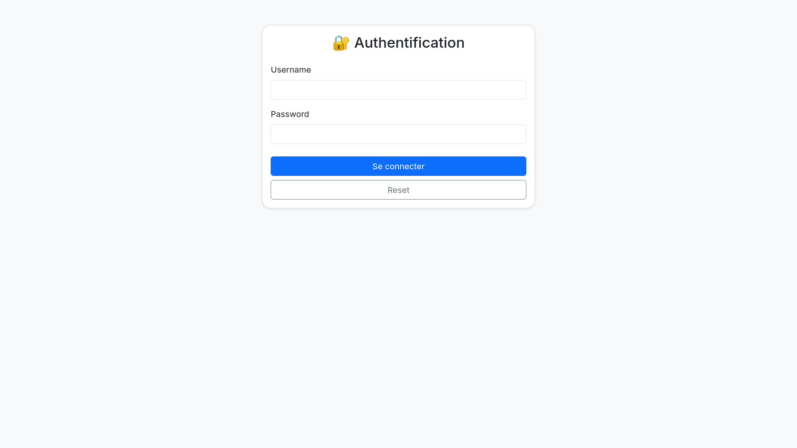

# 💬 Real-Time Chat Backend API

## 🌱 About

**Real-Time Chat Backend API** is a secure application based on JWT authentication. Spring Boot, STOMP, and WebSocket.

## 🖥️ Tech stack

- **Backend**  : Java 21, Spring Boot, Spring Security, Websocket / STOMP
- **Frontend** : JavaScript ES6, StompJS, Bootstrap 5

## 🚀 Setup

1. Clone the repository using :

```bash
https://github.com/loickcherimont/springboot-jwt-secure-chat-api.git
```

2. Go in the projet and run it :

```bash
cd springboot-jwt-secure-chat-api
./mvnw clean spring-boot:run
```

3. Here you are on the real-time secure chat application



## 🔑 License

This application is powered by **Loick CHERIMONT**

---

<div align="center">&copy; 2026 x Loick CHERIMONT</div>
